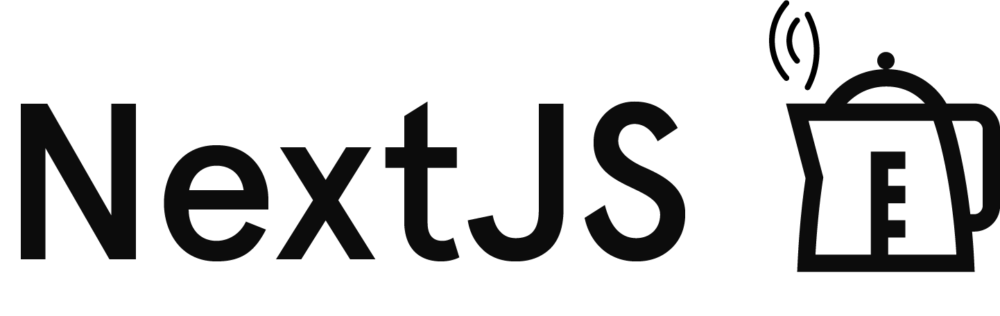

<div align="center"></div>
<h3 align="center"><strong>:zap: Simple NextJS Boilerplate :zap:</strong></h3>

## Contents

- [Installation](#installation)
- [Workflow](#workflow)

### Installation
Clone the repo :ghost::
```sh
git clone https://github.com/theghostyced/nextjs-boilerplate.git 'or preferred name here'
cd nextjs-boilerplate
```

Initialize your own .git:
```sh
rm -rf .git && git init && yarn init
```

Install the dependencies:
```bash
yarn install
```
or
```sh
npm install
```

### Workflow
Start a live-reload development server:
```sh
yarn dev
```
or
```sh
npm run dev
```

Generate a production build:
```sh
yarn build
```
or
```sh
npm run build
```
### Deployment
[](https://deploy.now.sh/?repo=https://github.com/theghostyced/nextjs-boilerplate)

### Contribution
I'm open to contributions & suggestions in making this a lot better :hand:

### License
MIT
